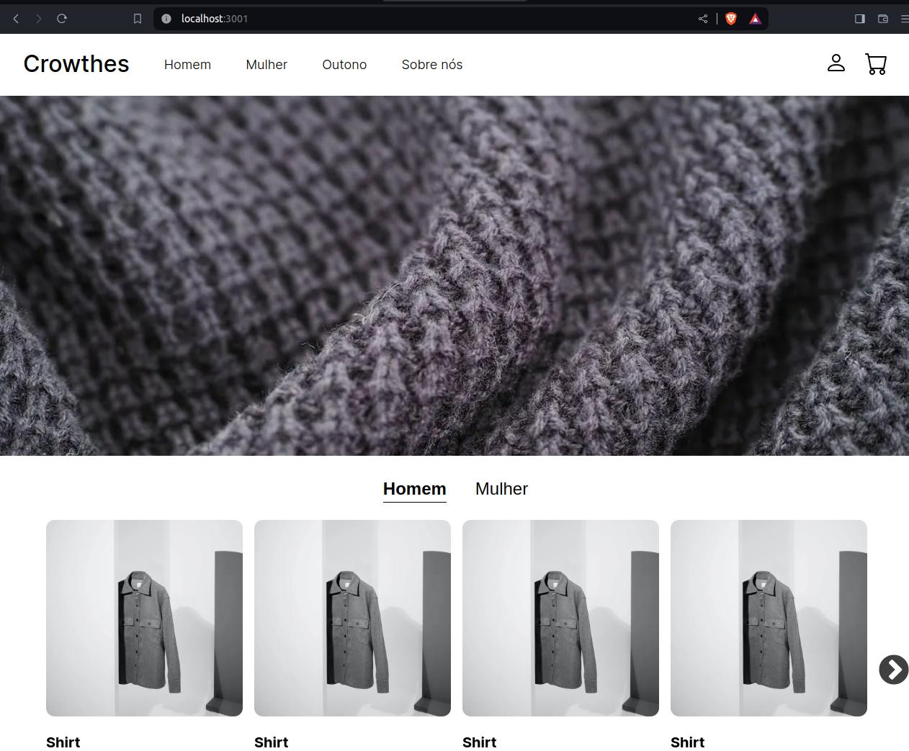
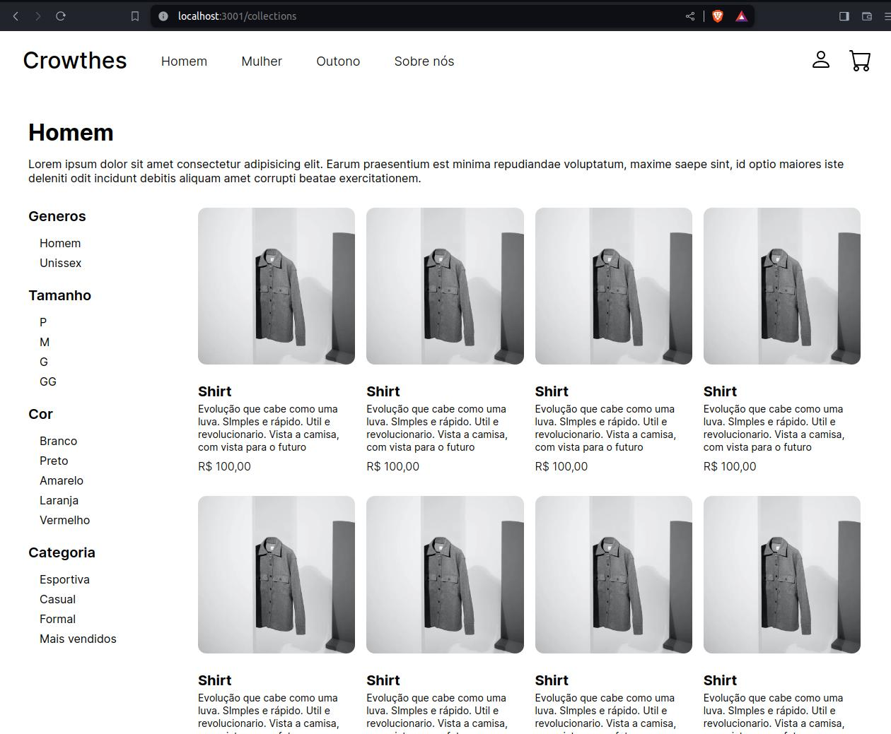
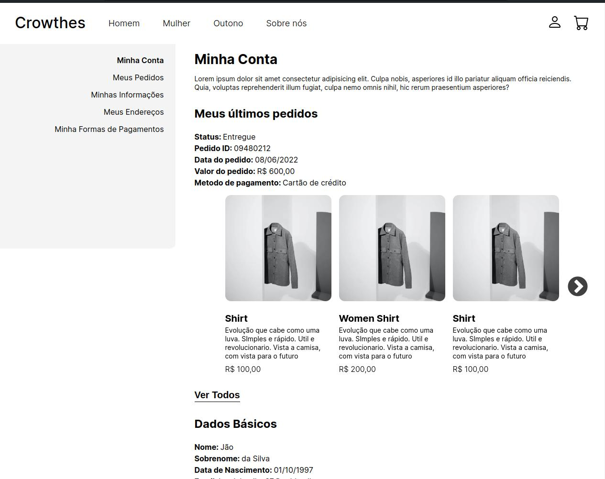
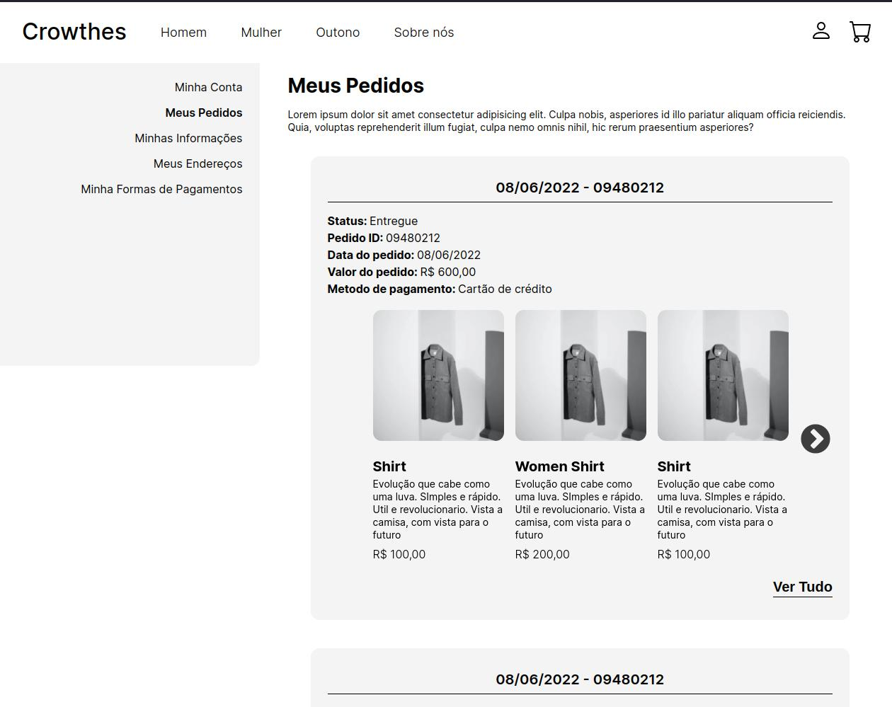

# clothes-store-js
A simple clothes e-commerce using next.js. Still in progress.

## Install and run
To install and run use these commands:

### Install
```bash
npm install
```

### Start
```bash
npm run dev
```

## Homepage
A simple page with a banner and some products displaying



## Category Page
A simple page with some categories and products


## My Account
A page with the user data


## My Orders
A page with the user orders
